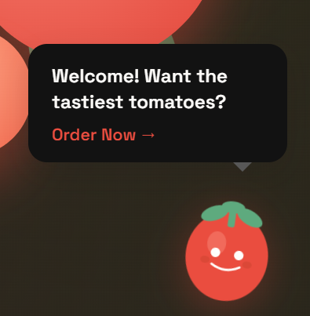

# Redwood Tomato Nursery - Landing Page (Lab 3)

A fully responsive landing page for a tomato breeding nursery with animated mascot and modern CSS framework integration.

## Live demo

Deploy link here: 
https://filipobrijan.github.io/web-lab3/

## New Features (Lab 3)

### Responsive Design
- Fully responsive layout for mobile, tablet, and desktop
- Mobile-optimized navigation with floating CTA button
- Adaptive element sizing across all screen sizes
- Mobile-only promotional banner section

### Animated Mascot
- Friendly tomato character that appears after page load
- Smooth bounce and tilt animations
- Interactive hover tooltip with call-to-action message
- Mobile-responsive positioning
### Mascot

### CSS Framework
- Integrated Bootstrap 5.3.2 for enhanced functionality
- Utilized Bootstrap grid system (row/col)
- Implemented Bootstrap form controls and utilities
- Seamless integration with custom styling

## Sections

- Hero with call to action
- Services
- Why us?
- Mobile-only promotional banner
- Contact form
- Animated mascot helper

## Technologies Used

- HTML5
- CSS3 with custom properties
- Bootstrap 5.3.2
- Vanilla JavaScript
- Google Fonts (Fraunces & Space Grotesk)

## Development Branches

- `responsive-design` - Mobile-first responsive improvements
- `add-animated-mascot` - Friendly tomato mascot with animations
- `css-framework-bootstrap` - Bootstrap CSS framework integration
